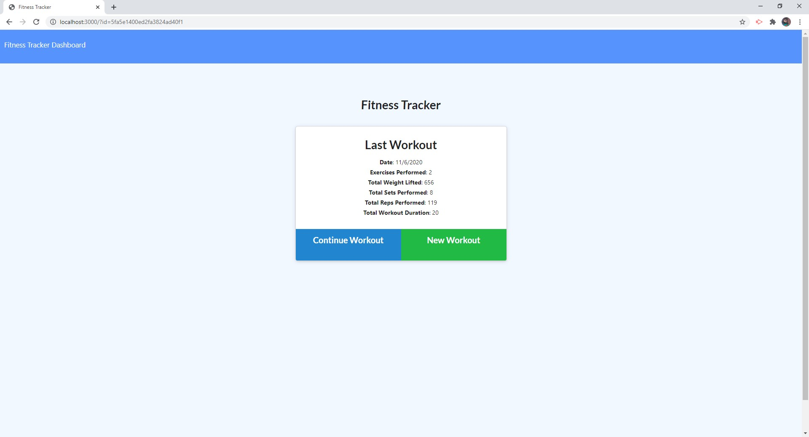
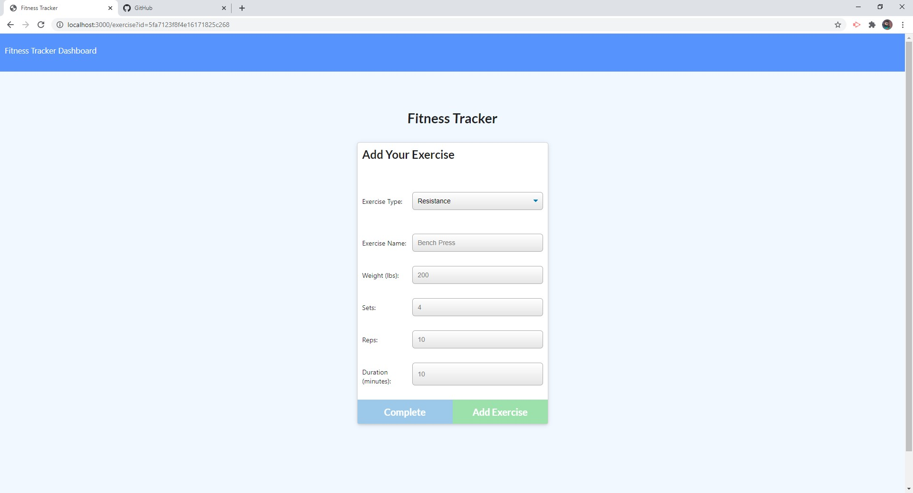
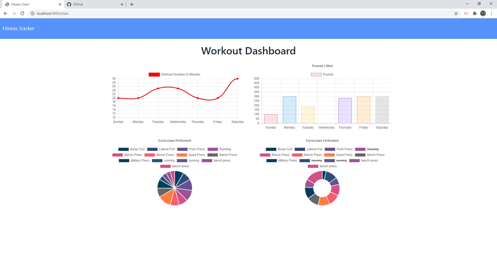

# Workout-Tracker

[Heroku App](https://nameless-dusk-72885.herokuapp.com/)

## Table of Contents

- [Description](#description)
- [License](#license)
- [Contributions](#contributions)
- [Test](#test)
- [Technologies](#technologies)
- [Questions](#questions)

## Description:

This app helps you keep track of your daily workouts by allowing you to enter multiple exercises for a given workout. The exercises can be either resistance or cardio. Based off what you choose there is different required inputs that will be tracked. A summary of the last workout is displayed after entering data and upon launching the app.

There is also a useful stats summary dashboard that lets you visualize your workouts over time. It does this by showing you graphs, and various charts.

## License:

## Contributions:

Right now I am the only one who has contributed, if you would like to then send a pull request and I will review it.

## Test:

No testing.

## Technologies:

This application uses Node express for routing and user interface functionality. It also uses HTML, Front-End Javascript, & CSS. For the backend cloud technology is leveraged through the use of Mongoose & the MongoDB Atlas database solution.

## Questions

For more information you can visit my [Github](https://github.com/grantscriver)
If you have any additional questions you can email me at: Grantscriver@gmail.com